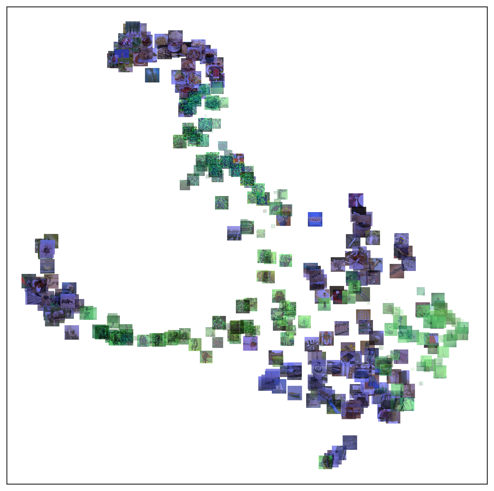
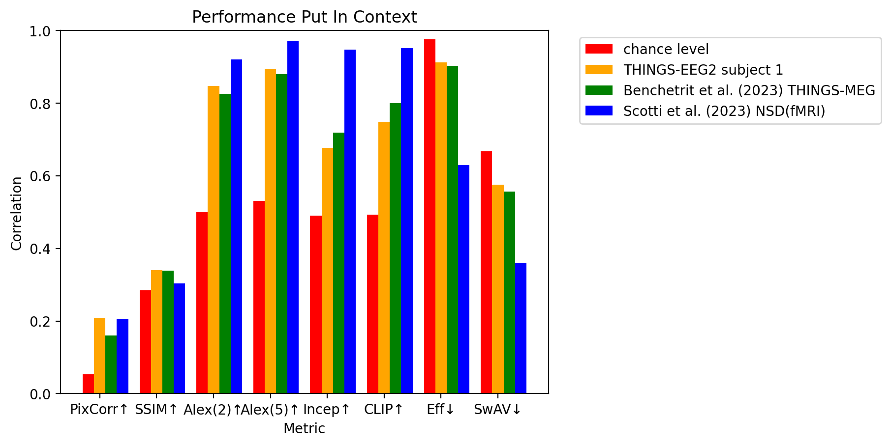
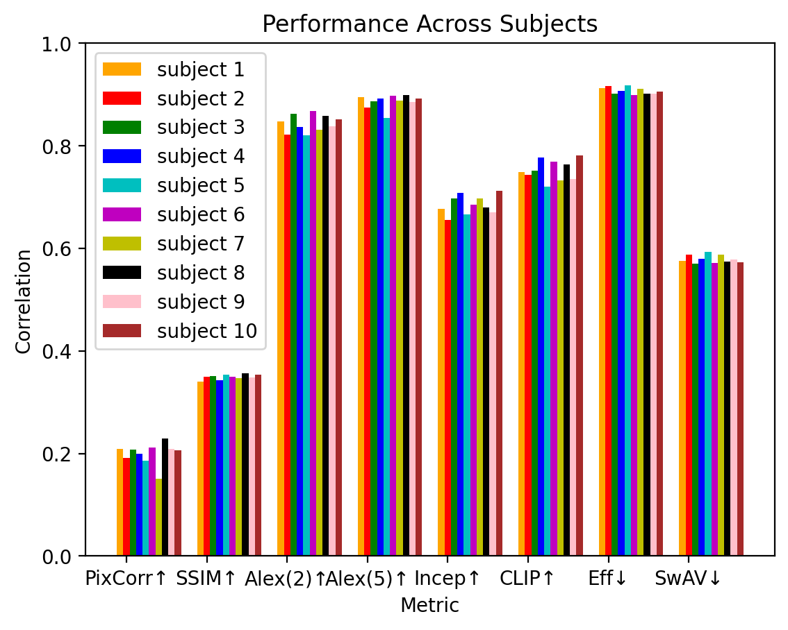

# Visual Reconstruction with Latent Diffusion through Linear Mapping
Check out the preprint: [Image Reconstruction from Electroencephalography Using Latent Diffusion](https://arxiv.org/abs/2404.01250)

Example reconstructions for subject 1. Reconstructions with pairwise correlation from best to worst for the final CLIP embedding. Each row of images with blue frames are the ground truth images. Each row of images with green frames directly under the blue-framed images correspond to the reconstruction of those images.

## UMAP Mapping

UMAP of Final CLIP Embeddings for ground truth (blue) and reconstructed images (green) from subject 1. The transparency level as well as the size of the green images indicate the correlation of CLIP vector between the corresponding reconstructed image and ground truth image pair. The ground truth images themselves form two clusters of images: animals and food, which reflects the 2 most prominent clusters in the reconstructed images as well.

## Feature transfer through narrow time segment swapping

Examples of data segment swapping. Each pair of rows represents the 2 images that have parts of the EEG swapped. The images for each pair of rows from top to bottom are: "gorilla_18s.jpg" and "gopher_09s.jpg"; "chaps_18s.jpg" and "headscarf_03s.jpg"; "cat_01b.jpg" and "coverall_06s.jpg"; "sausage_04s.jpg" and "piglet_02s.jpg"; "caterpillar_03s.jpg" and "possum_05s.jpg"; "cart_09s.jpg" and "elephant_11n.jpg". Each image in a row represents the result of swapping a time window of 50ms (5 samples). The next image is the result of moving the time window by 10ms (1 sample). The last image of each row is added as a reference since it does not have any swapping.

## Performance
<!-- 
 -->
<!--  -->
 


# EEG visual reconstruction
This section covers the visual reconstruction using the THINGS-EEG2 dataset

## Getting started
1. Follow instructions from brain-diffusor to create the python environment\
Note: please make sure tokenizers==0.12.1 and transformers==4.19.2. For the diffusion environment, you may use `requirement.txt`

+ For mac and linux:
```
virtualenv pyenv --python=3.10.12
source pyenv/bin/activate
pip install -r requirements.txt
```
+ For Windows:
```
virtualenv pyenv --python=3.10.12
pyenv\Scripts\activate
pip install -r requirements.txt
```


2. Download [preprocessed eeg data](https://osf.io/anp5v/), unzip "sub01", "sub02", etc under data/thingseeg2_preproc.

```
cd data/
wget https://files.de-1.osf.io/v1/resources/anp5v/providers/osfstorage/?zip=
mv index.html?zip= thingseeg2_preproc.zip
unzip thingseeg2_preproc.zip -d thingseeg2_preproc
cd thingseeg2_preproc/
unzip sub-01.zip
unzip sub-02.zip
unzip sub-03.zip
unzip sub-04.zip
unzip sub-05.zip
unzip sub-06.zip
unzip sub-07.zip
unzip sub-08.zip
unzip sub-09.zip
unzip sub-10.zip
cd ../../
python thingseeg2_data_preparation_scripts/prepare_thingseeg2_data.py 
```

3. Download [ground truth images](https://osf.io/y63gw/), unzip "training_images", "test_images" under data/thingseeg2_metadata
```
cd data/
wget https://files.de-1.osf.io/v1/resources/y63gw/providers/osfstorage/?zip=
mv index.html?zip= thingseeg2_metadata.zip
unzip thingseeg2_metadata.zip -d thingseeg2_metadata
cd thingseeg2_metadata/
unzip training_images.zip
unzip test_images.zip
cd ../../
python thingseeg2_data_preparation_scripts/save_thingseeg2_images.py
python thingseeg2_data_preparation_scripts/save_thingseeg2_concepts.py
```

4. Download VDVAE and Versatile Diffusion weights
```
cd vdvae/model/
wget https://openaipublic.blob.core.windows.net/very-deep-vaes-assets/vdvae-assets-2/imagenet64-iter-1600000-log.jsonl
wget https://openaipublic.blob.core.windows.net/very-deep-vaes-assets/vdvae-assets-2/imagenet64-iter-1600000-model.th
wget https://openaipublic.blob.core.windows.net/very-deep-vaes-assets/vdvae-assets-2/imagenet64-iter-1600000-model-ema.th
wget https://openaipublic.blob.core.windows.net/very-deep-vaes-assets/vdvae-assets-2/imagenet64-iter-1600000-opt.th
cd ../../versatile_diffusion/pretrained/
wget https://huggingface.co/shi-labs/versatile-diffusion/resolve/main/pretrained_pth/vd-four-flow-v1-0-fp16-deprecated.pth
wget https://huggingface.co/shi-labs/versatile-diffusion/resolve/main/pretrained_pth/kl-f8.pth
wget https://huggingface.co/shi-labs/versatile-diffusion/resolve/main/pretrained_pth/optimus-vae.pth
cd ../../
```

5. Extract train and test latent embeddings from images and text labels
```
python thingseeg2_data_preparation_scripts/vdvae_extract_features.py 
python thingseeg2_data_preparation_scripts/clipvision_extract_features.py 
python thingseeg2_data_preparation_scripts/cliptext_extract_features.py 
python thingseeg2_data_preparation_scripts/evaluation_extract_features_from_test_images.py 
```
 
## Training and reconstruction
```
python thingseeg2_scripts/train_regression.py 
python thingseeg2_scripts/reconstruct_from_embeddings.py 
python thingseeg2_scripts/evaluate_reconstruction.py 
python thingseeg2_scripts/plot_reconstructions.py -ordered True
```


# MEG visual reconstruction
This section covers the visual reconstruction using the THINGS-MEG dataset

## Getting started
1. Follow instructions from brainmagick and brain-diffusor to create the python environments for both\
Note: please make sure tokenizers==0.12.1 and transformers==4.19.2

<!-- 2. TODO: data downloading instructions -->
2. Download the THINGS-Images, then save the images and categories as numpy files:
```
source diffusion/bin/activate
python save_things_images.py
python save_things_categories.py
```

3. Preprocess the MEG data and prepare the stimuli:
```
conda activate bm
python preprocess_meg.py
python preprocess_meg_epoching.py
python get_stims1b.py
```
(optional) Get the captions for the images:
```
conda activate lavis
python generate_captions1b.py
```

## Create the training embeddings from the stimulus
<!-- Run `get_precomputed_clipvision.py`, `get_precomputed_clipvision.py`, and `get_precomputed_autokl.py` -->
```
source diffusion/bin/activate
python vdvae_extract_features1b.py
python cliptext_extract_features.py
python clipvision_extract_features.py
```

## First Stage Reconstruction with VDVAE
1. Download pretrained VDVAE model files and put them in `vdvae/model/` folder
```
wget https://openaipublic.blob.core.windows.net/very-deep-vaes-assets/vdvae-assets-2/imagenet64-iter-1600000-log.jsonl
wget https://openaipublic.blob.core.windows.net/very-deep-vaes-assets/vdvae-assets-2/imagenet64-iter-1600000-model.th
wget https://openaipublic.blob.core.windows.net/very-deep-vaes-assets/vdvae-assets-2/imagenet64-iter-1600000-model-ema.th
wget https://openaipublic.blob.core.windows.net/very-deep-vaes-assets/vdvae-assets-2/imagenet64-iter-1600000-opt.th
```
2. Extract VDVAE latent features of stimuli images, train regression models from MEG to VDVAE latent features and save test predictions for individual test trials as well as averaged test trials:
```
source diffusion/bin/activate
python vdvae_regression1b.py
python vdvae_reconstruct_images1b.py
```

## Second Stage Reconstruction with Versatile Diffusion
1. Download pretrained Versatile Diffusion model "vd-four-flow-v1-0-fp16-deprecated.pth", "kl-f8.pth" and "optimus-vae.pth" from [HuggingFace](https://huggingface.co/shi-labs/versatile-diffusion/tree/main/pretrained_pth) and put them in `versatile_diffusion/pretrained/` folder
<!-- 2. Extract CLIP-Text features of the image categories by running `python cliptext1b_regression_alltokens.py`
TODO: make regression for image captions -->
2. Train regression models from MEG to CLIP-Text features and save test predictions by running `python cliptext1b_regression_alltokens.py` \
TODO: make regression for image captions
<!-- 3. Extract CLIP-Vision features of stimuli images by running `clipvision1b_regression.py` -->
3. Train regression models from MEG to CLIP-Vision features and save test predictions by running `python clipvision1b_regression.py`
4. Reconstruct images from predicted test features using `python versatilediffusion_reconstruct_images1b.py`

## Averaged Test Trials Reconstruction
1. Save averaged test predictions:
```
python avg1b_regression_prediction.py
```
2. First Stage Reconstruction with VDVAE:
```
python avg1b_vdvae_reconstruct_images1b.py
```
3. Second Stage Reconstruction with Versatile Diffusion:
```
python avg1b_versatilediffusion_reconstruct_images1b.py
```

# Citations
Ozcelik, F., & VanRullen, R. (2023). Natural scene reconstruction from fMRI signals using generative latent diffusion. Scientific Reports, 13(1), 15666. https://doi.org/10.1038/s41598-023-42891-8

Gifford, A. T., Dwivedi, K., Roig, G., & Cichy, R. M. (2022). A large and rich EEG dataset for modeling human visual object recognition. NeuroImage, 264, 119754. https://doi.org/10.1016/j.neuroimage.2022.119754

Benchetrit, Y., Banville, H., & King, J.-R. (n.d.). BRAIN DECODING: TOWARD REAL-TIME RECONSTRUCTION OF VISUAL PERCEPTION.

Hebart, M. N., Contier, O., Teichmann, L., Rockter, A. H., Zheng, C. Y., Kidder, A., Corriveau, A., Vaziri-Pashkam, M., & Baker, C. I. (2023). THINGS-data, a multimodal collection of large-scale datasets for investigating object representations in human brain and behavior. eLife, 12, e82580. https://doi.org/10.7554/eLife.82580


